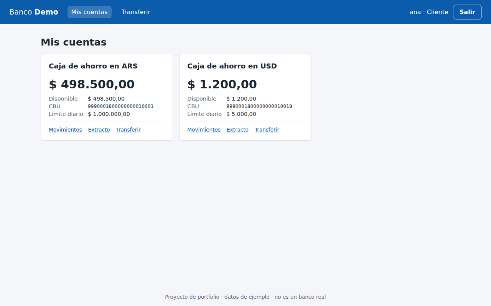
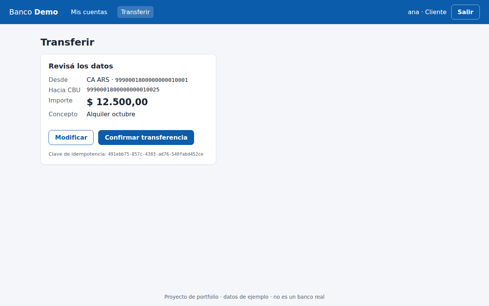
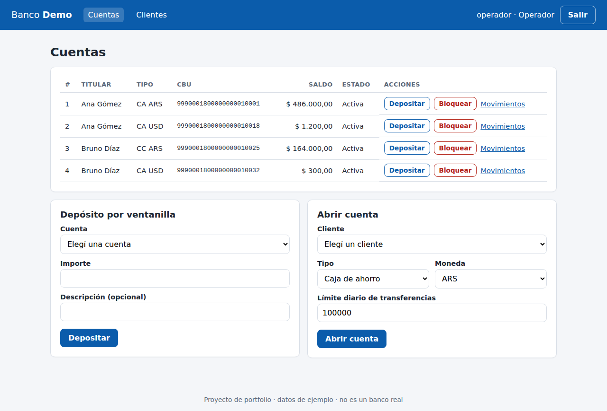
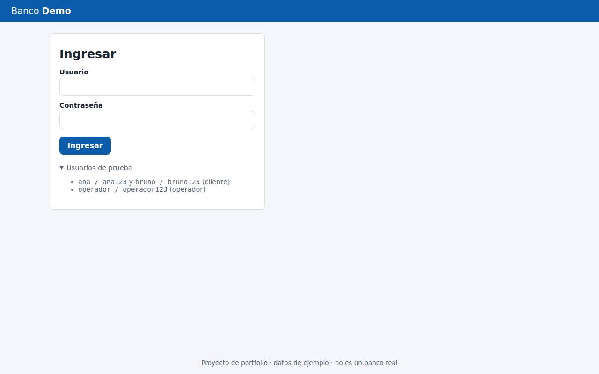
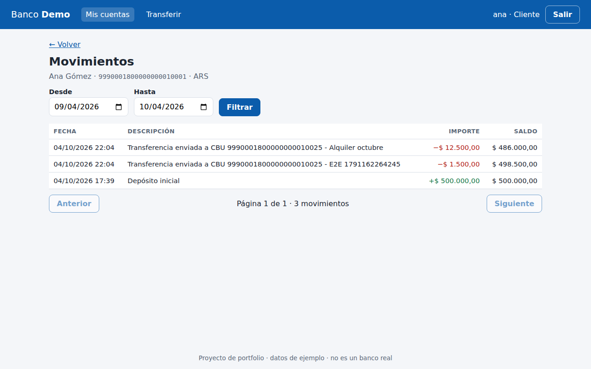

[Versión en castellano](README.md)

# Accounts and transfers: Spring Boot API + Angular web app

A REST API built with Java 21 and Spring Boot 3.5 that models the basics of a bank: customers, accounts (savings and checking, in Argentine pesos and US dollars), account movements and transfers between accounts. It also has an **Angular frontend** (online banking for customers plus back-office screens for operators), **Redis** for caching and login rate limiting, and a **CI pipeline** on GitHub Actions. It is a portfolio project with sample data: no bank uses it. It targets **Full Stack Java + Angular developer** job postings (Java, Spring, Angular, TypeScript, SQL, Redis, Git, Docker, CI/CD, Linux, REST, testing) and covers the kind of work banks, fintechs and consulting firms in Argentina usually ask for, with a focus on the parts that must not fail in this kind of system: a transfer must never run twice, two concurrent transfers must never overdraw an account, and errors must be easy to understand.

The code, API messages and comments are in Spanish (the target audience is Argentine). This page is a translation of the main README.

**Backend stack:** Java 21 · Spring Boot 3.5.16 · Spring Web · Spring Data JPA / Hibernate · PostgreSQL 16 · Flyway · Spring Security (JWT resource server) · Spring Cache + Spring Data Redis (Redis 7) · Bean Validation · springdoc-openapi (Swagger UI) · JUnit 5 · Mockito · MockMvc · Maven.

**Frontend stack:** Angular 22 (standalone components, signals, strict TypeScript, Reactive Forms, lazy-loaded routes) · Vitest · Playwright · ESLint · nginx.

**Infra:** Docker · Docker Compose (Postgres + Redis + API + web) · GitHub Actions.

| My accounts (customer) | Transfer confirmation |
|---|---|
|  |  |

## What it does

- **Customers and users.** There are two roles. `CLIENTE` (customer) sees and operates only their own accounts. `OPERADOR` (bank employee) creates customers and accounts, records deposits, blocks accounts and can see everything. Passwords are stored with BCrypt.
- **Accounts.** An account is `CA` (savings) or `CC` (checking), in `ARS` or `USD`. Each one has a 22-digit CBU (the Argentine bank account number) generated with the real check-digit algorithm and a daily transfer limit. A checking account can also have an agreed overdraft.
- **Transfers** between accounts of this bank:
  - same currency only (a currency mismatch is rejected explicitly, with no conversion);
  - atomic: the debit, the credit, the transfer and both movements are all applied, or none of them is;
  - pessimistic locks taken in a fixed order, so there is no overdraft and no deadlock;
  - a mandatory `Idempotency-Key` header, so a retried request does not transfer twice;
  - a daily limit per account, with the day computed in Argentina time.
- **Movements.** The history is paginated and can be filtered by date. The **statement** for a period includes the opening balance, total credits, total debits and the closing balance.
- **Errors** follow RFC 7807 (`ProblemDetail`), with Spanish messages and a stable machine-readable `codigo`.
- **OpenAPI** at `/swagger-ui.html`.
- **Redis cache** for each customer's account list, invalidated whenever any account changes, and **login rate limiting** (5 failures in 15 minutes → 429) with counters in Redis. See [Redis](#redis-cache-and-login-rate-limiting).
- **Angular web app** (in [`web/`](web/)): see [Screens](#screens-web).

### Screens (web)

The UI is in Spanish (Argentine audience).

| Screen | Who | What it does |
|---|---|---|
| Login | public | Reactive Form with validation; shows the API error (bad credentials, 429 for too many attempts, expired session) |
| My accounts | CLIENTE | Cards with balance, available funds (including overdraft), CBU and daily limit |
| Movements | both | Paginated table with a `from`/`to` date filter (validated: from ≤ to) |
| Statement | both | Opening balance, credits, debits and closing balance for a period |
| Transfer | CLIENTE | Three steps: details → **confirmation** → receipt. Validates the CBU (22 digits) and the amount (max. 2 decimals) before calling the API. The `Idempotency-Key` is generated in the browser (UUID) |
| Accounts (operator) | OPERADOR | All accounts, **cash deposit**, **block / unblock**, **open an account** |
| Customers (operator) | OPERADOR | List and **create customer** (first name, last name, DNI, email) |



### Endpoints

| Method | Path | Who | What |
|---|---|---|---|
| POST | `/api/auth/login` | public | Returns a JWT (429 + `Retry-After` after 5 consecutive failures) |
| GET | `/api/cuentas` | both | CLIENTE: own accounts. OPERADOR: all of them (`?clienteId=` to filter) |
| GET | `/api/cuentas/{id}` | both | Details (another customer's account returns 404) |
| POST | `/api/cuentas` | OPERADOR | Opens an account and generates its CBU |
| PATCH | `/api/cuentas/{id}/estado` | OPERADOR | `ACTIVA` / `BLOQUEADA` |
| POST | `/api/cuentas/{id}/depositos` | OPERADOR | Cash deposit at a branch |
| GET | `/api/cuentas/{id}/movimientos` | both | `?desde=YYYY-MM-DD&hasta=…&pagina=0&tamanio=20` |
| GET | `/api/cuentas/{id}/extracto` | both | `?desde=…&hasta=…` (defaults to the last 30 days) |
| POST | `/api/transferencias` | both | Requires the `Idempotency-Key` header |
| GET | `/api/transferencias/{id}` | both | CLIENTE: only if they own the source or destination account |
| POST | `/api/clientes` | OPERADOR | Creates a customer |
| GET | `/api/clientes` | OPERADOR | Lists customers |
| GET | `/api/clientes/{id}` | both | CLIENTE: only their own record |

Demo users (loaded only when `CARGAR_DATOS_DEMO=true` and the database is empty): `ana / ana123` and `bruno / bruno123` (CLIENTE), `operador / operador123` (OPERADOR).

## Design decisions

### Concurrency: pessimistic locks in a fixed order

A transfer reads the balance, checks it and updates it. If two transfers from the same account do that at the same time without protection, both see the same balance and both succeed (the classic *lost update*). This was verified: without the lock, the concurrency test approves 20 transfers when only 10 fit.

- `CuentaRepository.buscarParaActualizar` uses `@Lock(PESSIMISTIC_WRITE)`. On PostgreSQL, Hibernate issues `SELECT … FOR NO KEY UPDATE`: the row stays locked until commit, and any other transfer touching that account waits.
- **Lock order:** the account with the lower id is always locked first. If A→B and B→A run at the same time, both ask for the same row first, so one waits for the other and no deadlock happens. Without that ordering, the crossed-transfers test fails with PostgreSQL's `ERROR: deadlock detected` (also verified).
- **Why not optimistic locking (`@Version`)?** On a busy account (for example, one that receives many payments) optimistic locking causes many conflicts, and each one needs a retry. Pessimistic locking puts the operations in a queue. Transactions are short (a few queries), so the wait is small.
- A JPA detail: before locking, only the destination account's id is read (`buscarIdPorCbu`), not the entity. If the entity were already in the persistence context, the later `SELECT … FOR UPDATE` would hand back the cached instance with a stale balance.
- The daily limit is computed **while the source account is locked**, so the total sent that day is exact.
- As a last line of defence, the database has `CHECK (saldo >= -descubierto_autorizado)`.

### Idempotency (`Idempotency-Key`)

If a client sends a transfer and the connection drops before the response arrives, the client cannot tell whether the transfer happened. With this header it can retry safely:

- The key is stored in the `transferencia` table under `UNIQUE (usuario, idempotency_key)`, together with a SHA-256 hash of the request data.
- Same key with **the same data**: the original transfer comes back (same id) with `Idempotent-Replayed: true`, and no money moves.
- Same key with **different data**: `422 clave-idempotencia-reutilizada`.
- **Two identical requests at the same time:** the second one waits for the account lock. When it gets the lock, it finds the key already committed and returns the original. If the race happens some other way, the second request hits the UNIQUE constraint, its whole transaction (including the debit) is rolled back, and the service reads the winning transfer in a fresh query. That is why `TransferenciaService` is not transactional and delegates to `EjecutorDeTransferencias`, which is.
- Only successful transfers are recorded. A failed one (for example, insufficient funds) leaves no trace, so it can be retried with the same key.

### CBU check digits

A CBU has 22 digits in two blocks, and each block ends with a check digit:

| Block | Content | Weights |
|---|---|---|
| 1 (8 digits) | bank (3) + branch (4) + check digit | 7, 1, 3, 9, 7, 1, 3 |
| 2 (14 digits) | account number (13) + check digit | 3, 9, 7, 1, 3, 9, 7, 1, 3, 9, 7, 1, 3 |

In each block, every digit is multiplied by its weight and the results are added up. The check digit is `(10 - sum % 10) % 10`. The algorithm is in [`Cbu.java`](src/main/java/ar/cuentas/dominio/Cbu.java) and is tested against a real CBU published as an example (`2850590940090418135201`). Generated CBUs use a fictitious bank code (`999`) and branch `0001`, and the account number comes from a PostgreSQL sequence. A destination CBU with a wrong check digit is rejected with 400 before the database is touched.

### Errors

Every error response is `application/problem+json`, for example:

```json
{
  "type": "urn:cuentas-api:error:monedas-distintas",
  "title": "Operación rechazada",
  "status": 422,
  "detail": "No se puede transferir entre cuentas de distinta moneda (ARS a USD). Esta API no hace conversión de moneda.",
  "instance": "/api/transferencias",
  "codigo": "monedas-distintas"
}
```

| Status | When |
|---|---|
| 400 | Validation (with a per-field `errores` list), unreadable JSON, missing `Idempotency-Key`, invalid dates |
| 401 | No token, expired or tampered token, wrong credentials |
| 403 | The role is not allowed (for example, a CLIENTE trying to open an account) |
| 404 | Does not exist, **or belongs to another customer**: both cases look the same, so the API does not reveal which ids exist |
| 409 | Uniqueness conflict in the database |
| 429 | Too many failed logins for that user (`demasiados-intentos`, with a `Retry-After` header) |
| 422 | Business rule: `saldo-insuficiente` (insufficient funds), `monedas-distintas`, `limite-diario-excedido`, `cuenta-bloqueada`, `misma-cuenta`, `clave-idempotencia-reutilizada`, `dni-duplicado`… |
| 503 | The database aborted because of a lock problem (should not happen; retry with the same key) |

401 and 403 happen in the security filter chain, before any controller runs, so they have their own handler ([`ProblemaSeguridadHandler`](src/main/java/ar/cuentas/seguridad/ProblemaSeguridadHandler.java)) that writes the same format.

### Security

- JWT signed with HS256. Instead of a hand-written filter, the API uses Spring Security's *resource server* support, which validates the signature, expiry and issuer. The token carries `sub`, `rol` and `clienteId`.
- **The secret comes from the `JWT_SECRET` environment variable.** `application.yml` has a default that starts with `solo-desarrollo-local…` ("local development only"), meant only for running on your own machine. When that default is in use, the app logs a warning. A secret shorter than 32 bytes stops the app from starting. In `docker-compose.yml` the variable is required.
- Passwords use BCrypt. Login runs the BCrypt comparison even when the user does not exist, so response time does not reveal which users exist.
- `@PreAuthorize` handles the OPERADOR-only actions. Ownership checks live in the services.
- The API is stateless and uses no cookies, so CSRF protection is disabled.

### Other decisions

- Money is `BigDecimal` / `NUMERIC(19,2)`, never `double`. Amounts can have at most 2 decimals.
- Timestamps are stored in UTC (`TIMESTAMPTZ`). The "day" for the daily limit and the `desde`/`hasta` filters use `America/Argentina/Buenos_Aires`. A `Clock` is injected so tests can fix the date.
- Balance rules live in the `Cuenta` entity (`debitar`, `acreditar`), so they can be tested without a database.
- DTOs are `record`s and the mapping is written by hand; with this few classes there was no need for MapStruct.
- `spring.jpa.open-in-view=false` and `ddl-auto=validate`: only Flyway changes the schema.

### Redis: cache and login rate limiting

Redis is used for **two things**, neither of them essential: if Redis goes down the API keeps working against PostgreSQL (covered by `SinRedisIntegrationTest`).

**1. Cache of a customer's account list** (`GET /api/cuentas`, the online-banking home screen, requested on every navigation).

- Spring Cache with `@Cacheable` in [`CuentasDelClienteService`](src/main/java/ar/cuentas/cache/CuentasDelClienteService.java), keyed by customer id. Stored in Redis as JSON (`cuentas-api:cuentas-por-cliente::1`) with a 5-minute TTL (`CACHE_TTL_CUENTAS`).
- **Invalidation:** a JPA listener on the `Cuenta` entity ([`InvalidadorDeCacheDeCuentas`](src/main/java/ar/cuentas/cache/InvalidadorDeCacheDeCuentas.java)) evicts the customer's entry whenever an account is created or changed (transfer, deposit, block, new account). It lives on the entity instead of in each use case so that no code path can forget it: a transfer touches two accounts, possibly owned by two customers, and both are evicted.
- **After commit:** the eviction is registered with `TransactionSynchronization.afterCommit()`. Evicting before the commit would let another request re-cache the old balance in between; and if the transaction rolls back (insufficient funds, say), there is nothing to evict.
- **Not cached:** the operator's full list (it changes with any operation), movements and statements. Most importantly, **operations never read the cache**. Transfers and deposits read the account from PostgreSQL with a lock, so a cached balance can never approve a transfer without funds (covered by `elSaldoCacheadoNoAfectaLasReglasDeLaTransferencia`).

**Stale data risk (and why it is acceptable here).** There are two ways the list can show an outdated balance: (a) Redis does not answer exactly when evicting, so the old entry lives until the TTL expires (an `ERROR` is logged); (b) someone changes an account outside JPA (a manual `UPDATE` in the database). In both cases the worst effect is **displaying** an old balance for up to 5 minutes; no money is lost or duplicated, because the rules are checked against the database. In a real bank this would be a business discussion: maybe cache only non-balance data, or lower the TTL.

**2. Login rate limiting** ([`LimitadorDeIntentosDeLogin`](src/main/java/ar/cuentas/seguridad/LimitadorDeIntentosDeLogin.java)).

- One counter per username (`INCR` + `PEXPIRE` in a Lua script, atomic): on the fifth failure within 15 minutes, login for that user returns **429** with `Retry-After`, **even if the password is correct** (otherwise an attacker could keep guessing and learn when they got it right). A successful login resets the counter.
- Why Redis and not an in-memory `Map`: with several API instances they all see the same counter, and Redis handles expiry on its own.
- **Fail-open:** if Redis does not answer, the login is allowed (with a warning in the log). Customers being able to log in takes priority; the alternative (fail-closed) is safer but locks everyone out when Redis is down.
- Known limitation: someone can deliberately lock another user out for 15 minutes by failing 5 times with their username. That is the cost of limiting per user; also limiting per IP would mitigate it.

### Frontend (web/)

- **Standalone Angular 22**, no NgModules. State with **signals** (`signal`, `computed`); RxJS only for HTTP. `ChangeDetectionStrategy.OnPush` and no zone.js.
- Functional **JWT interceptor**: adds `Authorization: Bearer …` to `/api/**` and, on a 401, ends the session and goes to the login page with the reason.
- **Role guards** (`authGuard`, `rolGuard('OPERADOR')`, `invitadoGuard`). They are a navigation aid, not security: the API enforces the real permissions.
- **ProblemDetail errors:** [`errores.ts`](web/src/app/core/errores.ts) turns any HttpClient error into a Spanish message (using the API's `detail` when present) and attaches the API's validation errors to the matching form control.
- **Client-side Idempotency-Key:** generated when moving to the confirmation step and reused if the user retries *that same* transfer (for example, after a dropped connection). If they edit the details again, a new one is generated.
- The token is kept in `sessionStorage` (cleared when the tab closes). Any script on the page could read it; the defence is Angular's escaping plus a strict `Content-Security-Policy` sent by nginx.
- In Docker, **nginx** serves the build and proxies `/api` to the API: the browser sees a single origin, so no CORS is needed. In development, `ng serve` uses `proxy.conf.json` for the same thing.

### Diagrams

Layers and model ([source](docs/diagramas/arquitectura.puml)):


Transfer sequence ([source](docs/diagramas/secuencia-transferencia.puml)):


## Structure

```
src/main/java/ar/cuentas/
├── web/            REST controllers, DTOs (records), CBU validation
├── servicio/       use cases: TransferenciaService (idempotency),
│                   EjecutorDeTransferencias (@Transactional, locks), accounts, movements
├── repositorio/    Spring Data JPA (including SELECT ... FOR UPDATE)
├── dominio/        JPA entities with rules (Cuenta, Movimiento, Transferencia), Cbu
├── cache/          Spring Cache + Redis: config, cached list, invalidation
├── seguridad/      JWT, Spring Security config, 401/403 as ProblemDetail, login rate limit (Redis)
├── error/          @RestControllerAdvice and exceptions
└── config/         clock, OpenAPI, properties, demo data
src/main/resources/db/migration/   Flyway migrations
src/test/java/ar/cuentas/
├── dominio/        unit tests (CBU, Cuenta rules)
├── servicio/       Mockito unit tests
└── integracion/    MockMvc and real HTTP against PostgreSQL and Redis (including concurrency)
web/                Angular frontend
├── src/app/core/       session (signals), JWT interceptor, guards, errors, API, validators
├── src/app/paginas/    login, accounts (movements, statement), transfer, operator
├── e2e/                Playwright (full walkthrough + screenshot script)
├── nginx.conf          serves the build and proxies /api
└── Dockerfile
.github/workflows/ci.yml   backend + frontend + Docker images + e2e
docs/               diagrams (PlantUML) and screenshots
ejemplos.http       ready-made requests for IntelliJ / VS Code REST Client
```

## How to run

### With a local PostgreSQL

You need Java 21, Maven 3.9+, PostgreSQL 16 and (optionally) Redis 7.

```bash
createdb cuentas                      # plus cuentas_test for the tests
export DB_URL=jdbc:postgresql://localhost:5432/cuentas DB_USER=postgres DB_PASSWORD=postgres
export JWT_SECRET="$(openssl rand -base64 48)"   # optional locally; otherwise the dev default is used
mvn spring-boot:run
```

- API: http://localhost:8080
- Swagger UI: http://localhost:8080/swagger-ui.html (use "Authorize" with the token from the login)

Redis is optional locally: if there is none at `localhost:6379` (`REDIS_HOST`/`REDIS_PORT`), the API still works, without cache or login rate limiting, and says so in the log.

The demo CBUs are: Ana ARS `9990001800000000010001`, Ana USD `9990001800000000010018`, Bruno ARS `9990001800000000010025` and Bruno USD `9990001800000000010032`.

```bash
TOKEN=$(curl -s -X POST localhost:8080/api/auth/login -H 'Content-Type: application/json' \
  -d '{"username":"ana","password":"ana123"}' | jq -r .token)

curl -i -X POST localhost:8080/api/transferencias \
  -H "Authorization: Bearer $TOKEN" -H 'Content-Type: application/json' \
  -H 'Idempotency-Key: 7f1c0e7a-alquiler-octubre' \
  -d '{"cuentaOrigenId":1,"cbuDestino":"9990001800000000010025","importe":85000,"concepto":"Alquiler octubre"}'
# HTTP/1.1 201 · Location: /api/transferencias/1 · Idempotent-Replayed: false
# Running the same command again returns the same transfer with Idempotent-Replayed: true
```

[`ejemplos.http`](ejemplos.http) has more requests, including the error cases.

### With Docker Compose (simplest; also on Windows 10 with Docker Desktop)

```bash
cp .env.example .env      # and set your own JWT_SECRET (at least 32 characters)
docker compose up -d --build --wait
```

On Windows (PowerShell), with Docker Desktop running: `copy .env.example .env`, edit `.env` in Notepad, then the same `docker compose up -d --build --wait`.

| Service | Container | URL / port on your machine |
|---|---|---|
| Web (nginx + Angular) | `cuentas-web` | http://localhost:4201 |
| API (Spring Boot) | `cuentas-api` | http://localhost:8082 · Swagger: http://localhost:8082/swagger-ui.html |
| PostgreSQL 16 | `cuentas-db` | `localhost:54321` (user and database `cuentas`) |
| Redis 7 | `cuentas-redis` | `localhost:63791` |

The ports are deliberately unusual so they do not clash with a locally installed PostgreSQL or Redis. To stop everything: `docker compose down` (add `-v` to delete the database too).

### Frontend without Docker

You need Node.js 24 (or 22.22.3+; Angular 22 rejects older versions).

```bash
cd web
npm ci
npm start        # http://localhost:4200, proxying /api to http://localhost:8080 (the local API)
```

If the API runs in Docker (port 8082), change the `target` in `web/proxy.conf.json`.

## Tests

### Backend (74 tests)

The integration tests run against a **real PostgreSQL**, not H2, because row locks (`FOR UPDATE`), constraints and timestamp handling must behave as they do in production. The same goes for **Redis**: the cache and login-limit tests use a real Redis (database 1, flushed before each test), not a mock. Testcontainers is not used; the `test` profile points to local services (in CI, to the job's service containers):

```bash
createdb cuentas_test
redis-server &          # or: docker run -d -p 6379:6379 redis:7-alpine
mvn verify
# another database or Redis: TEST_DB_URL=... TEST_DB_USER=... TEST_DB_PASSWORD=... TEST_REDIS_HOST=... TEST_REDIS_PORT=... mvn verify
```

Each integration test truncates the tables (`TRUNCATE … RESTART IDENTITY`) and loads its own data. Latest run:

```
Tests run: 74, Failures: 0, Errors: 0, Skipped: 0
BUILD SUCCESS
```

| Class | Kind | What it covers |
|---|---|---|
| `CbuTest` (11) | unit | Check-digit algorithm, against a real CBU and with invalid cases |
| `CuentaTest` (6) | unit | Debit, insufficient funds, checking-account overdraft, blocked account, no overdraft on savings |
| `EjecutorDeTransferenciasTest` (7) | Mockito | Lock order, currency mismatch, daily limit (Argentina time), account ownership, movements |
| `TransferenciaServiceTest` (6) | Mockito | Idempotent replay, key reused with different data, race settled by UNIQUE, hash |
| `AuthIntegrationTest` (4) | MockMvc + PG | Login, wrong credentials, no token, tampered token |
| `CuentaIntegrationTest` (8) | MockMvc + PG | Role-based visibility, 404 for other customers' accounts, creation with a valid CBU, validation, deposits, blocking |
| `TransferenciaIntegrationTest` (12) | MockMvc + PG | Happy path, insufficient funds with no side effects, overdraft, idempotency, daily limit, invalid CBU… |
| `MovimientoIntegrationTest` (4) | MockMvc + PG | Pagination, date filter in Argentina time, statement, invalid parameters |
| `ConcurrenciaIntegrationTest` (3) | real HTTP + PG | **20 parallel transfers** from an account with funds for 10: exactly 10 succeed and the balance ends at 0. **Crossed A↔B transfers** with no deadlock. **10 simultaneous retries** with the same key: one transfer |
| `CacheCuentasIntegrationTest` (8) | MockMvc + PG + Redis | The list is stored in Redis as JSON with a TTL; the 2nd request skips the database; a transfer evicts both customers; a rejected one evicts nothing; deposit, block and new account evict; a cached balance does not affect the rules |
| `LimiteLoginIntegrationTest` (4) | MockMvc + PG + Redis | 429 on the fifth failure even with the right password; the counter expires and a good login resets it; case and spaces count as the same user |
| `SinRedisIntegrationTest` (1) | MockMvc + PG, Redis down | Login, account list and transfer work while Redis is unreachable |

The 61 tests the project had before Redis was added still pass unchanged.

### Frontend (41 unit tests + 1 e2e)

```bash
cd web
npm test              # Vitest (jsdom): 41 tests
npm run lint          # ESLint with angular-eslint
npx playwright test   # e2e; needs the stack running (docker compose up -d --wait) and Chromium
```

| File | What it covers |
|---|---|
| `sesion.service.spec.ts` (5) | Saving/restoring the session, token expiry, corrupt data in storage |
| `auth.interceptor.spec.ts` (4) | Adds the Bearer only to `/api`, not to the login; on 401 ends the session and goes to login (except for the login's own 401) |
| `guards.spec.ts` (4) | No session → login (remembering where the user was going); wrong role → home; logged-in users skip the login page |
| `errores.spec.ts` (6) | ProblemDetail → message, field errors attached to controls, API down (status 0), responses that are not ProblemDetail |
| `validadores.spec.ts` (5) | CBU (22 digits and check digits), amount (positive, 2 decimals), date range |
| `idempotencia.spec.ts` (2) | UUID v4, also without `crypto.randomUUID` (plain http outside localhost) |
| `login.spec.ts` (4), `transferir.spec.ts` (5) | Forms: validation, 429 message, no open redirect through `?volver=`, confirmation step, **same Idempotency-Key on retry**, new key after editing, 422 error without losing the data |
| `app.spec.ts` (3), `app.routes.spec.ts` (3) | Menu per role; redirects for `/` and unknown routes |
| `e2e/recorrido.spec.ts` (Playwright) | Against the real stack: login → my accounts → transfer with confirmation → movements → **balance changed (cache evicted)** → log out |

### CI (GitHub Actions)

[`.github/workflows/ci.yml`](.github/workflows/ci.yml) runs on every push to `main` and on every pull request:

1. **backend:** `mvn -B verify` with PostgreSQL 16 and Redis 7 as service containers.
2. **frontend:** `npm ci`, lint, tests and production build (Node 24).
3. **docker:** builds the API and web images (after 1 and 2 pass).
4. **e2e:** `docker compose up --build --wait` and the Playwright walkthrough in Chromium; on failure it uploads the report and the logs.

## What is tested and what isn't

| Topic | Status |
|---|---|
| Backend tests (74) against local PostgreSQL 16 and Redis 7 | ✅ Run, all passing (`mvn verify`) |
| Frontend unit tests (41), lint and production build | ✅ Run, all passing |
| Playwright e2e against the Docker Compose stack | ✅ Run, passing |
| `docker compose up` with Postgres + Redis + API + web, real login through nginx, cache key in Redis | ✅ Started and checked (ports 4201/8082/54321/63791). Note: in the environment where this was built, the images were built from the same Dockerfiles plus one line to trust that environment's network-proxy certificate; with direct internet access it is not needed |
| GitHub Actions workflow | ⚠️ Validated with `actionlint` (no errors), but **not run on GitHub** from here: it runs once pushed to the repo |
| Docker Desktop on Windows 10 | ⚠️ Not tested (Linux only); the commands are the same |
| The concurrency test really catches bugs | ✅ Checked by hand: without `@Lock` it fails (20 approved instead of 10); without the lock order, PostgreSQL reports `deadlock detected` |
| The app running for real (`java -jar`): login, transfer, idempotent retry, 422 error and movements via curl | ✅ Done by hand |
| Swagger UI | ✅ Rendered and used through Playwright (the screenshots in `docs/capturas/`) |
| JWT expiry | ⚠️ Enforced by Spring Security, but there is no dedicated test (there is one for a tampered token) |
| Several API instances against the same database and Redis | ⚠️ The lock lives in the database and the counters in Redis, so it should work, but it was not tested |
| Accessibility and responsive design of the web app | ⚠️ Forms have `label`s and basic ARIA roles; not audited with a screen reader or on phones |
| Performance and load | ❌ Not measured |
| Transfers to other banks, currency conversion, token refresh or revocation, password recovery, per-IP login limiting | ❌ Out of scope, not implemented |

## Screenshots

| Login | Movements after a transfer |
|---|---|
|  |  |

| Transfer executed from Swagger | Business error as ProblemDetail |
|---|---|
|  |  |

The web screenshots are regenerated with `CAPTURAS=1 npx playwright test capturas` (from `web/`, with the stack running).

## How to talk about it in an interview

1. **What it is:** a small full-stack online bank: a Spring Boot REST API on PostgreSQL plus an Angular frontend, with Redis and CI. It is a portfolio project with sample data.
2. **The hard part is the backend:** atomic transfers with pessimistic locks in a fixed order (no overdrafts, no deadlocks) and idempotency through `Idempotency-Key`. I prove it with a test that fires 20 parallel transfers against funds for 10.
3. **The frontend follows the same idea:** the `Idempotency-Key` is generated in the browser on confirmation and reused on retry, so a double click or a dropped connection never transfers twice.
4. **Redis with judgement:** I cache only the account list, evict after commit from an entity listener, and operations never read the cache. I know the risk (a stale balance visible for up to 5 minutes if eviction fails) and why it never moves money.
5. **Login rate limiting in Redis:** an atomic Lua counter, 429 with `Retry-After`, and an explicit *fail-open* decision if Redis is down.
6. **Modern Angular:** standalone, signals, typed Reactive Forms, functional interceptor and guards, ProblemDetail errors mapped onto each form field.
7. **Tests at every layer:** 74 backend tests against real Postgres and Redis (no H2, no mocks), 41 frontend unit tests and a Playwright e2e against the Docker Compose stack. All of it runs on GitHub Actions.
8. **Honesty:** the README states what I tested and what I did not (for example, I did not see the workflow run on GitHub from the environment where I built it).

**Likely questions**

- *Why not use the cached balance to validate the transfer?* Because the balance used to operate must come from the database, under a lock. The cache is display-only.
- *What happens if Redis goes down?* The API keeps working: the cache falls back to the database and login fails open. `SinRedisIntegrationTest` covers it.
- *Why evict after commit?* If I evict before, another request could re-cache the old balance before the new one is committed.
- *Where do you keep the JWT and what is the risk?* In `sessionStorage`. An XSS could read it; Angular's escaping and a strict CSP in nginx mitigate it. The alternative is an `HttpOnly` cookie, which brings CSRF handling.
- *Are Angular guards security?* No, they are navigation. The API enforces permissions (403/404).
- *Why signals instead of RxJS for everything?* For screen state they are simpler and need no unsubscribing; I keep RxJS for HTTP.
- *What would you improve?* Testcontainers to avoid depending on local services, refresh tokens, per-IP login limiting, and cache metrics (hits/misses).
