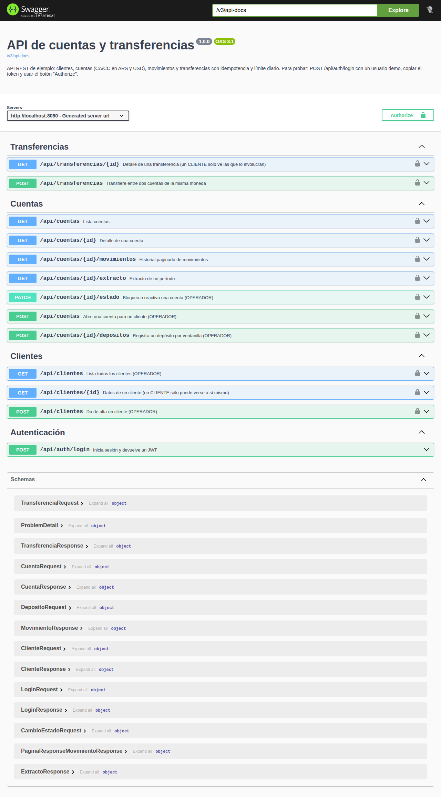
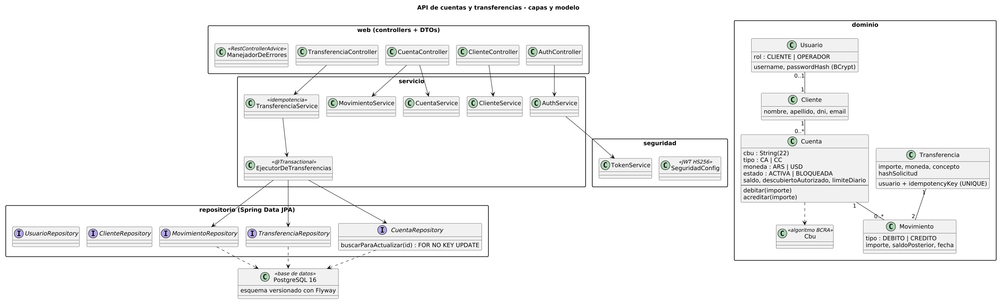
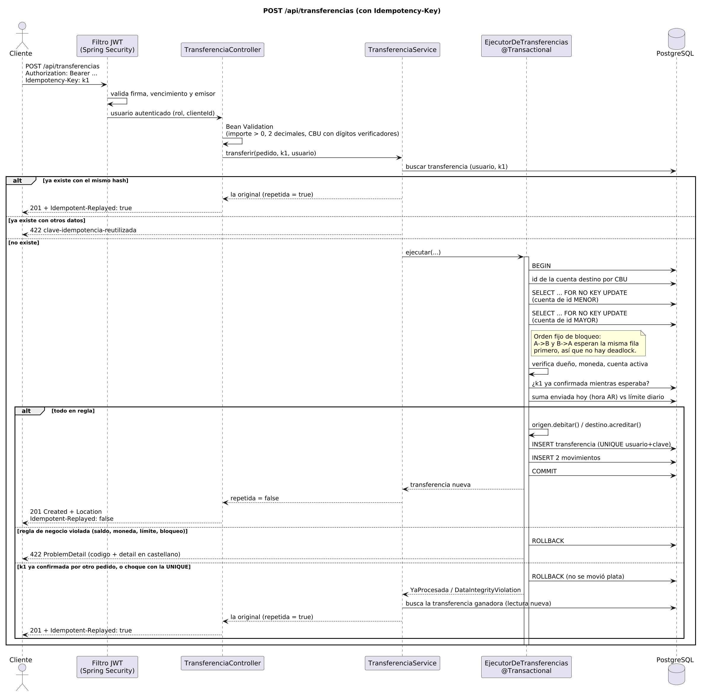
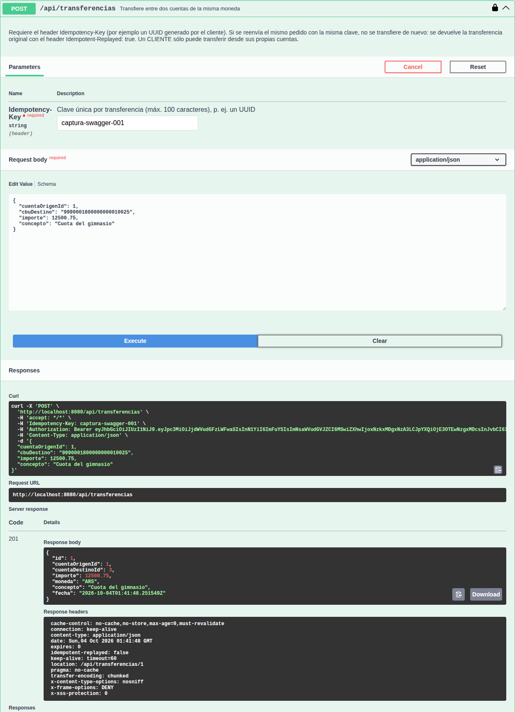
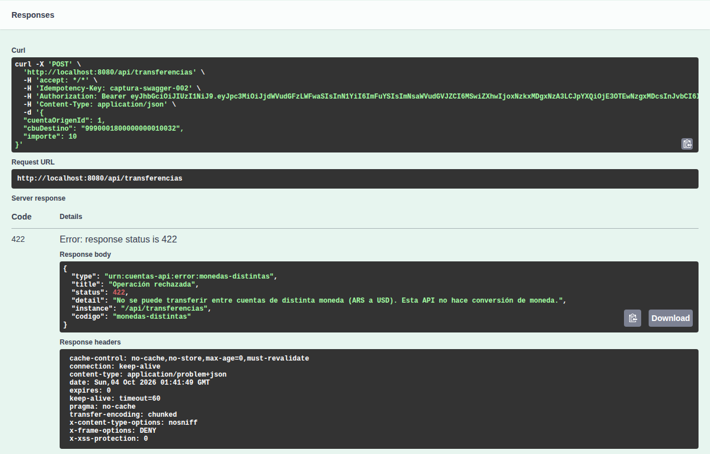

[English version](README.en.md)

# API de cuentas y transferencias

API REST hecha con Java 21 y Spring Boot 3.5 que modela lo básico de un banco: clientes, cuentas (caja de ahorro y cuenta corriente, en pesos y dólares), movimientos y transferencias entre cuentas. Es un proyecto de portfolio: no lo usa ningún banco. Cubre lo que suelen pedir los bancos, las fintechs y las consultoras en el día a día, con foco en las partes que en este tipo de sistemas no pueden fallar: que una transferencia no se ejecute dos veces, que dos transferencias simultáneas no dejen una cuenta en negativo y que los errores se entiendan.

**Stack:** Java 21 · Spring Boot 3.5.16 · Spring Web · Spring Data JPA / Hibernate · PostgreSQL 16 · Flyway · Spring Security (resource server JWT) · Bean Validation · springdoc-openapi (Swagger UI) · JUnit 5 · Mockito · MockMvc · Maven · Docker.



## Qué hace

- **Clientes y usuarios.** Hay dos roles. `CLIENTE` ve y opera sólo sus cuentas. `OPERADOR` da de alta clientes y cuentas, registra depósitos, bloquea cuentas y puede ver todo. Las contraseñas se guardan con BCrypt.
- **Cuentas.** Pueden ser `CA` (caja de ahorro) o `CC` (cuenta corriente), en `ARS` o `USD`. Cada una tiene un CBU de 22 dígitos generado con el algoritmo real de dígitos verificadores, un límite diario de transferencias y, en el caso de la CC, un descubierto acordado opcional.
- **Transferencias** entre cuentas de este banco:
  - sólo entre cuentas de la misma moneda (si no coinciden, se rechazan explícitamente: no hay conversión);
  - son atómicas: se aplican el débito, el crédito, la transferencia y los dos movimientos, o no se aplica nada;
  - usan locks pesimistas con un orden fijo, así no hay sobregiros ni deadlocks;
  - el header `Idempotency-Key` es obligatorio, así un reintento no transfiere dos veces;
  - controlan el límite diario por cuenta, con el día calculado en hora argentina.
- **Movimientos.** El historial está paginado y se puede filtrar por fechas. El **extracto** de un período trae saldo inicial, total de créditos, total de débitos y saldo final.
- **Errores** en formato RFC 7807 (`ProblemDetail`), con mensajes en castellano y un `codigo` estable para que lo lea un programa.
- **OpenAPI** en `/swagger-ui.html`.

### Endpoints

| Método | Ruta | Quién | Qué hace |
|---|---|---|---|
| POST | `/api/auth/login` | público | Devuelve un JWT |
| GET | `/api/cuentas` | ambos | CLIENTE: sus cuentas. OPERADOR: todas (`?clienteId=` para filtrar) |
| GET | `/api/cuentas/{id}` | ambos | Detalle (si la cuenta es ajena, 404) |
| POST | `/api/cuentas` | OPERADOR | Abre una cuenta y genera el CBU |
| PATCH | `/api/cuentas/{id}/estado` | OPERADOR | `ACTIVA` / `BLOQUEADA` |
| POST | `/api/cuentas/{id}/depositos` | OPERADOR | Depósito por ventanilla |
| GET | `/api/cuentas/{id}/movimientos` | ambos | `?desde=AAAA-MM-DD&hasta=…&pagina=0&tamanio=20` |
| GET | `/api/cuentas/{id}/extracto` | ambos | `?desde=…&hasta=…` (por defecto, los últimos 30 días) |
| POST | `/api/transferencias` | ambos | Requiere el header `Idempotency-Key` |
| GET | `/api/transferencias/{id}` | ambos | CLIENTE: sólo si es origen o destino |
| POST | `/api/clientes` | OPERADOR | Alta de cliente |
| GET | `/api/clientes` | OPERADOR | Lista de clientes |
| GET | `/api/clientes/{id}` | ambos | CLIENTE: sólo sus propios datos |

Usuarios demo (sólo se cargan si `CARGAR_DATOS_DEMO=true` y la base está vacía): `ana / ana123` y `bruno / bruno123` (CLIENTE), `operador / operador123` (OPERADOR).

## Decisiones de diseño

### Concurrencia: lock pesimista con orden fijo

Una transferencia lee el saldo, lo valida y lo modifica. Si dos transferencias desde la misma cuenta hacen eso a la vez sin protección, las dos ven el mismo saldo y las dos pasan (el clásico *lost update*). Está comprobado: sin el lock, el test de concurrencia muestra 20 transferencias aprobadas de 10 posibles.

- `CuentaRepository.buscarParaActualizar` usa `@Lock(PESSIMISTIC_WRITE)`. En PostgreSQL, Hibernate lo traduce como `SELECT … FOR NO KEY UPDATE`: la fila queda bloqueada hasta el commit y cualquier otra transferencia que toque esa cuenta espera.
- **Orden de bloqueo:** siempre se bloquea primero la cuenta de id menor. Si A→B y B→A corren al mismo tiempo, las dos piden primero la misma fila, una espera a la otra y no hay deadlock. Si se quita el orden, el test de transferencias cruzadas termina con `ERROR: deadlock detected` de PostgreSQL (también está comprobado).
- **¿Por qué no un lock optimista (`@Version`)?** En una cuenta con mucho movimiento (por ejemplo, una que recibe muchos pagos) un lock optimista genera muchos conflictos, y cada uno obliga a reintentar. El pesimista, en cambio, pone las operaciones en fila. Las transacciones son cortas (unas pocas queries), así que la espera es chica.
- Un detalle de JPA: antes de tomar el lock no se carga la entidad de la cuenta destino, sólo su id (`buscarIdPorCbu`). Si estuviera cargada en el contexto de persistencia, el `SELECT … FOR UPDATE` posterior devolvería la instancia ya cargada, con un saldo viejo.
- El límite diario se calcula **con la cuenta de origen ya bloqueada**, así que la suma de lo enviado en el día es exacta.
- Como última defensa, la base tiene un `CHECK (saldo >= -descubierto_autorizado)`.

### Idempotencia (`Idempotency-Key`)

Si el cliente manda una transferencia y se corta la conexión antes de recibir la respuesta, no sabe si se hizo o no. Con este header puede reintentar sin miedo:

- La clave se guarda en la tabla `transferencia` con `UNIQUE (usuario, idempotency_key)`, junto con un hash SHA-256 de los datos del pedido.
- Si llega la misma clave con **los mismos datos**, se devuelve la transferencia original (mismo id) con `Idempotent-Replayed: true` y no se mueve plata.
- Si llega la misma clave con **otros datos**, se responde `422 clave-idempotencia-reutilizada`.
- **Dos pedidos iguales al mismo tiempo:** el segundo espera el lock de la cuenta. Cuando lo obtiene, encuentra la clave ya confirmada y devuelve la original. Si la carrera se da por otro camino, choca contra la constraint UNIQUE, su transacción se deshace entera (incluido el débito) y el servicio busca la transferencia ganadora en una lectura nueva. Por eso `TransferenciaService` no es transaccional y delega en `EjecutorDeTransferencias`, que sí lo es.
- Sólo quedan registradas las transferencias exitosas. Si una falla (por ejemplo, por saldo insuficiente) no deja rastro, y se puede reintentar con la misma clave.

### CBU con dígitos verificadores

El CBU tiene 22 dígitos en dos bloques, y cada bloque termina en un dígito verificador:

| Bloque | Contenido | Ponderadores |
|---|---|---|
| 1 (8 dígitos) | entidad (3) + sucursal (4) + verificador | 7, 1, 3, 9, 7, 1, 3 |
| 2 (14 dígitos) | número de cuenta (13) + verificador | 3, 9, 7, 1, 3, 9, 7, 1, 3, 9, 7, 1, 3 |

En cada bloque se multiplica cada dígito por su ponderador y se suman los resultados. El verificador es `(10 - suma % 10) % 10`. Está implementado en [`Cbu.java`](src/main/java/ar/cuentas/dominio/Cbu.java) y probado contra un CBU real publicado como ejemplo (`2850590940090418135201`). Los CBU que genera la API usan una entidad ficticia (`999`) y la sucursal `0001`. El número de cuenta sale de una secuencia de PostgreSQL. Un CBU de destino con un verificador incorrecto se rechaza con 400 antes de tocar la base.

### Errores

Todas las respuestas de error son `application/problem+json`:

```json
{
  "type": "urn:cuentas-api:error:saldo-insuficiente",
  "title": "Operación rechazada",
  "status": 422,
  "detail": "Saldo insuficiente en la cuenta 9990001800000000010001: disponible 100.00 ARS, se intentó debitar 150.00 ARS.",
  "instance": "/api/transferencias",
  "codigo": "saldo-insuficiente"
}
```

| Status | Cuándo |
|---|---|
| 400 | Validación (con lista `errores` campo por campo), JSON ilegible, falta `Idempotency-Key`, fechas inválidas |
| 401 | Sin token, token vencido o adulterado, credenciales incorrectas |
| 403 | El rol no alcanza (por ejemplo, un CLIENTE que quiere abrir una cuenta) |
| 404 | No existe, **o es de otro cliente**: no se distingue, para no revelar qué ids existen |
| 409 | Conflicto de unicidad en la base |
| 422 | Regla de negocio: `saldo-insuficiente`, `monedas-distintas`, `limite-diario-excedido`, `cuenta-bloqueada`, `misma-cuenta`, `clave-idempotencia-reutilizada`, `dni-duplicado`… |
| 503 | La base abortó por un problema de lock (no debería pasar; se puede reintentar con la misma clave) |

Los 401 y 403 se generan en el filtro de seguridad, antes del controller, así que tienen su propio handler ([`ProblemaSeguridadHandler`](src/main/java/ar/cuentas/seguridad/ProblemaSeguridadHandler.java)) con el mismo formato.

### Seguridad

- JWT firmado con HS256. En vez de escribir un filtro a mano, se usa el soporte de *resource server* de Spring Security, que valida la firma, el vencimiento y el emisor. El token lleva `sub`, `rol` y `clienteId`.
- **El secreto viene de la variable `JWT_SECRET`.** El `application.yml` trae un valor por defecto que empieza con `solo-desarrollo-local…`, pensado sólo para correrlo en la máquina propia. Si se usa ese valor, la app lo avisa en el log. Si el secreto tiene menos de 32 bytes, la app no arranca. En `docker-compose.yml` la variable es obligatoria.
- BCrypt para las contraseñas. En el login se hace la comparación BCrypt aunque el usuario no exista, para que el tiempo de respuesta no revele qué usuarios existen.
- Hay roles con `@PreAuthorize` para lo que es sólo de OPERADOR, y un control de titularidad en los servicios para lo que depende del dueño de la cuenta.
- La API es stateless y sin cookies, por eso CSRF está desactivado.

### Otras decisiones

- Importes como `BigDecimal` y `NUMERIC(19,2)`, nunca `double`. Se aceptan como máximo 2 decimales.
- Fechas guardadas en UTC (`TIMESTAMPTZ`). El "día" del límite diario y los filtros `desde`/`hasta` se interpretan en `America/Argentina/Buenos_Aires`. Se usa un `Clock` inyectable, lo que permite testear con la fecha fija.
- Las reglas de saldo viven en la entidad `Cuenta` (`debitar`, `acreditar`), así que se prueban sin base de datos.
- Los DTO son `record`s y el mapeo es a mano: con pocas clases no hacía falta MapStruct.
- `spring.jpa.open-in-view=false` y `ddl-auto=validate`: el esquema lo maneja sólo Flyway.

### Diagramas

Capas y modelo ([fuente](docs/diagramas/arquitectura.puml)):



Secuencia de una transferencia ([fuente](docs/diagramas/secuencia-transferencia.puml)):



## Estructura

```
src/main/java/ar/cuentas/
├── web/            controllers REST, DTOs (records) y validación de CBU
├── servicio/       casos de uso: TransferenciaService (idempotencia),
│                   EjecutorDeTransferencias (@Transactional, locks), cuentas, movimientos
├── repositorio/    Spring Data JPA (incluye el SELECT ... FOR UPDATE)
├── dominio/        entidades JPA con reglas (Cuenta, Movimiento, Transferencia), Cbu
├── seguridad/      JWT, configuración de Spring Security, 401/403 como ProblemDetail
├── error/          @RestControllerAdvice y excepciones
└── config/         reloj, OpenAPI, propiedades, datos demo
src/main/resources/db/migration/   migraciones de Flyway
src/test/java/ar/cuentas/
├── dominio/        tests unitarios (CBU, reglas de Cuenta)
├── servicio/       tests unitarios con Mockito
└── integracion/    MockMvc y HTTP real contra PostgreSQL (incluye la concurrencia)
docs/               diagramas (PlantUML) y capturas
ejemplos.http       pedidos listos para IntelliJ / VS Code REST Client
```

## Cómo correrlo

### Con PostgreSQL local

Requisitos: Java 21, Maven 3.9+ y PostgreSQL 16.

```bash
createdb cuentas                      # y cuentas_test para los tests
export DB_URL=jdbc:postgresql://localhost:5432/cuentas DB_USER=postgres DB_PASSWORD=postgres
export JWT_SECRET="$(openssl rand -base64 48)"   # opcional en local; si no, se usa el de desarrollo
mvn spring-boot:run
```

- API: http://localhost:8080
- Swagger UI: http://localhost:8080/swagger-ui.html (botón "Authorize" con el token del login)

Con los datos demo cargados, los CBU son: Ana ARS `9990001800000000010001`, Ana USD `9990001800000000010018`, Bruno ARS `9990001800000000010025` y Bruno USD `9990001800000000010032`.

```bash
TOKEN=$(curl -s -X POST localhost:8080/api/auth/login -H 'Content-Type: application/json' \
  -d '{"username":"ana","password":"ana123"}' | jq -r .token)

curl -i -X POST localhost:8080/api/transferencias \
  -H "Authorization: Bearer $TOKEN" -H 'Content-Type: application/json' \
  -H 'Idempotency-Key: 7f1c0e7a-alquiler-octubre' \
  -d '{"cuentaOrigenId":1,"cbuDestino":"9990001800000000010025","importe":85000,"concepto":"Alquiler octubre"}'
# HTTP/1.1 201 · Location: /api/transferencias/1 · Idempotent-Replayed: false
# Repetir el mismo comando devuelve la misma transferencia con Idempotent-Replayed: true
```

En [`ejemplos.http`](ejemplos.http) hay más pedidos, incluidos los de los casos de error.

### Con Docker Compose

```bash
cp .env.example .env      # completar JWT_SECRET
docker compose up --build
```

Levanta `postgres:16` y la API en el puerto 8080. **Ojo:** el `Dockerfile` y el `docker-compose.yml` están escritos pero no se pudieron probar: en el entorno donde se armó el proyecto no había Docker. Ver la tabla de abajo.

## Tests

Los tests de integración usan un **PostgreSQL real** y no H2, porque los locks (`FOR UPDATE`), las constraints y el manejo de fechas tienen que comportarse igual que en producción. No se usa Testcontainers porque en el entorno donde se armó el proyecto no había Docker; el perfil `test` apunta a una base local:

```bash
createdb cuentas_test
mvn test
# para usar otra base: TEST_DB_URL=jdbc:postgresql://host:5432/db TEST_DB_USER=... TEST_DB_PASSWORD=... mvn test
```

Cada test de integración vacía las tablas (`TRUNCATE … RESTART IDENTITY`) y carga sus datos. Resultado de la última corrida:

```
Tests run: 61, Failures: 0, Errors: 0, Skipped: 0
BUILD SUCCESS
```

| Clase | Tipo | Qué prueba |
|---|---|---|
| `CbuTest` (11) | unitario | Algoritmo de dígitos verificadores, contra un CBU real y con casos inválidos |
| `CuentaTest` (6) | unitario | Débito, saldo insuficiente, descubierto de CC, cuenta bloqueada, CA sin descubierto |
| `EjecutorDeTransferenciasTest` (7) | Mockito | Orden de bloqueo, monedas distintas, límite diario (hora AR), dueño de la cuenta, movimientos |
| `TransferenciaServiceTest` (6) | Mockito | Reintento idempotente, clave con otros datos, carrera resuelta por UNIQUE, hash |
| `AuthIntegrationTest` (4) | MockMvc + PG | Login, credenciales malas, sin token, token adulterado |
| `CuentaIntegrationTest` (8) | MockMvc + PG | Visibilidad por rol, 404 para cuentas ajenas, alta con CBU válido, validación, depósitos, bloqueo |
| `TransferenciaIntegrationTest` (12) | MockMvc + PG | Caso feliz, saldo insuficiente sin efectos, descubierto, idempotencia, límite diario, CBU inválido… |
| `MovimientoIntegrationTest` (4) | MockMvc + PG | Paginación, filtro de fechas en hora AR, extracto, parámetros inválidos |
| `ConcurrenciaIntegrationTest` (3) | HTTP real + PG | **20 transferencias en paralelo** desde una cuenta con saldo para 10: pasan exactamente 10 y el saldo queda en 0. **Transferencias cruzadas A↔B** sin deadlock. **10 reintentos simultáneos** con la misma clave: una sola transferencia |

## Qué está probado y qué no

| Tema | Estado |
|---|---|
| Tests unitarios y de integración (61) contra PostgreSQL 16 local | ✅ Corridos, todos pasan (`mvn test`) |
| Que el test de concurrencia detecta errores de verdad | ✅ Comprobado a mano: sin `@Lock` falla (20 aprobadas en vez de 10); sin el orden de bloqueo, PostgreSQL reporta `deadlock detected` |
| App corriendo de verdad (`java -jar`) con login, transferencia, reintento idempotente, error 422 y movimientos por curl | ✅ Hecho a mano |
| Swagger UI | ✅ Renderizado y usado con Playwright (son las capturas de `docs/capturas/`) |
| `Dockerfile` y `docker-compose.yml` | ⚠️ Escritos, **nunca construidos ni levantados** (no había Docker disponible) |
| Workflow de GitHub Actions | ⚠️ Escrito, **nunca ejecutado** |
| Vencimiento del JWT | ⚠️ Lo valida Spring Security, pero no hay un test específico (sí hay uno de token adulterado) |
| Varias instancias de la API contra la misma base | ⚠️ El lock está en la base, así que debería funcionar, pero no lo probé |
| Rendimiento y carga | ❌ No medido |
| Transferencias a otros bancos (interbancarias), conversión de moneda, refresh o revocación de tokens, límite de intentos de login | ❌ Fuera de alcance, no implementado |

## Capturas

| Transferencia ejecutada desde Swagger | Error de negocio como ProblemDetail |
|---|---|
|  |  |
